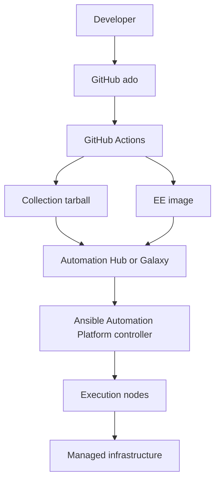
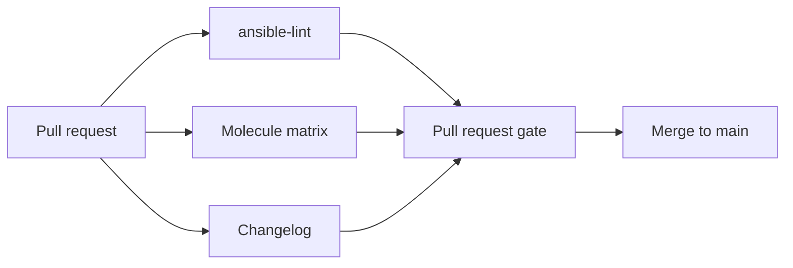

<p align="center">
  
</p>

# ADO Engineering Standards — Complete Package

Generated for sharing. Prefer the split files for day-to-day editing.
Style basis: Red Hat Technical Writing Style Guide.
Repository: Automation-Development-Office/documentation


<div class='page-break'></div>

# ADO Engineering Standards Package

| Field | Value |
|-------|--------|
| Collection | `infra.ado` |
| Handbook repository | [Automation-Development-Office/documentation](https://github.com/Automation-Development-Office/documentation) |
| Collection repository | [Automation-Development-Office/ado](https://github.com/Automation-Development-Office/ado) |
| Handbook version | 1.1.3 |
| Style basis | [Red Hat Technical Writing Style Guide](https://stylepedia.net/) |
| Audience | ADO engineers, contributors, and release engineers |

## Documents in This Package

| Document | Purpose |
|----------|---------|
| [ADO Engineering Standards](ADO-Engineering-Standards.md) | Authoritative handbook |
| [Pull Request Checklist](checklists/pr-checklist.md) | Checks to complete before you request review |
| [Validation Readiness Checklist](checklists/validation-readiness.md) | Scorecard for Red Hat Validated Content readiness |
| [Collection and Role Maturity Model](checklists/maturity-model.md) | Bronze through Platinum maturity levels |
| [templates/](templates/) | Skeletons aligned with the `ado` collection |
| [Gap Analysis](appendices/gap-analysis.md) | Current standards compared with recommended standards |
| [ADO-Engineering-Standards.pdf](ADO-Engineering-Standards.pdf) | Printable PDF generated from this package |
| [ADO-Engineering-Standards.html](ADO-Engineering-Standards.html) | HTML version of the same content |

## How to Use This Package

1. If you are new to ADO, read Parts I and II of the handbook, then complete the pull request checklist on a small change in the `ado` collection.
2. If you author roles, follow the role development chapter and the [role README template](https://github.com/Automation-Development-Office/ado/blob/main/docs/templates/role_readme_format_template.md) in the collection repository.
3. If you release collections, follow the release engineering chapter and the [Developers Guide](https://github.com/Automation-Development-Office/ado/blob/main/.github/Developers%20_Guide.md) for workflow steps.
4. When you change how ADO works, update this handbook in the same documentation pull request, or open a paired pull request in `ado` for tooling changes.

## Requirement Words

| Word | Meaning |
|------|---------|
| **must** | Required |
| **should** | Strongly recommended unless you document an exception |
| **can** / **might** | Optional or conditional |


<div class='page-break'></div>

<p align="center">
  
</p>

# ADO Engineering Standards

**Developing Enterprise Ansible Collections**

| Field | Value |
|-------|--------|
| Organization | Automation Development Office (ADO) |
| Collection | `infra.ado` |
| Handbook version | 1.1.3 |
| Style basis | [Red Hat Technical Writing Style Guide](https://stylepedia.net/) |
| Audience | ADO engineers, contributors, and release engineers |
| Handbook repository | [Automation-Development-Office/documentation](https://github.com/Automation-Development-Office/documentation) |
| Collection repository | [Automation-Development-Office/ado](https://github.com/Automation-Development-Office/ado) |
| Related procedure guide | [Developers Guide](https://github.com/Automation-Development-Office/ado/blob/main/.github/Developers%20_Guide.md) |

This handbook describes how ADO develops and maintains the `infra.ado` Ansible collection. Use it with the Developers Guide in the collection repository: this handbook sets policy; the Developers Guide documents workflow mechanics.

---

# Part I. Foundations

## Purpose of This Handbook

This handbook is the authoritative reference for ADO engineering practices for `infra.ado`. It is based on practices already present in the collection repository and states requirements where the project previously relied on convention alone.

This handbook is not a guide for submitting content to the Red Hat Validated Content program. Validation readiness is covered in a later chapter. After you read Parts I and II, you can clone the collection repository and contribute changes that meet ADO standards.

## About the Automation Development Office

The Automation Development Office develops reusable automation for Ansible Automation Platform environments. ADO provides tested, documented collections and execution environments that support consistent automation of enterprise infrastructure, including Ansible Automation Platform, OpenShift, Red Hat Enterprise Linux, Satellite, identity services, and related tooling.

The primary deliverable of the collection repository is the Ansible collection `infra.ado`.

## Requirement Words

This handbook uses the following words in the sense defined by the Red Hat Technical Writing Style Guide:

| Word | Meaning |
|------|---------|
| **must** | A requirement. You are required to do this. |
| **should** | A strong recommendation. Follow it unless you document a justified exception. |
| **can** / **might** | An optional or conditional action. |

Labels in this handbook:

- **Current standard** — Behavior that the collection repository already implements or enforces.
- **Recommended standard** — An ADO roadmap item that improves consistency or validation readiness but is not fully enforced yet.

## Guiding Principles

### Automate Repeatable Work

If you can automate a task safely and repeatedly, you should add that automation to the collection instead of relying on undocumented knowledge.

### Keep Each Role Focused

Each role must have a clear scope, for example `ocp_namespace`, `rhel_cron`, or `aap_build_ee`. If a role mixes unrelated concerns, you must split it.

### Design for Reuse

Write roles so that another team can consume them from Automation Hub or from a collection tarball without reading the implementation.

### Require Idempotence

When you run a role again with the same inputs, the end state should remain the same. Molecule verify stages should assert this where practical.

### Test Before You Merge

If a change alters automation behavior, it must pass the pull request gate: lint, Molecule, and changelog rules. See the testing and CI/CD chapters.

### Treat Documentation as Deliverable Content

A feature is complete only when the role README describes how to use it, and when a changelog fragment is present if project rules require one.

### Optimize for the Consumer

Prefer clear install paths, variable names, examples, and upgrade notes. Prefer predictable patterns over clever ones.

### Never Commit Secrets

You must not commit passwords, API keys, vault contents, customer data, or environment-specific secrets in issues, pull requests, or the repository. This rule is also stated in the ADO Code of Conduct addendum.

## Glossary

| Term | Definition |
|------|------------|
| Collection | Installable Ansible content unit defined by `galaxy.yml` (`infra.ado`) |
| Role | Reusable automation unit under `roles/` |
| Plugin | Module, filter, lookup, or similar content under `plugins/` (not used in this collection today) |
| Execution environment (EE) | Container image that Ansible Automation Platform uses to run jobs |
| Molecule scenario | Integration test under `extensions/molecule/<name>/` |
| Fragment | antsibull-changelog YAML file under `changelogs/fragments/` |
| Pull request gate | Jobs in `main.yml` that must succeed before merge |
| Validated Content | Red Hat program that reviews collections as recommended automation patterns |
| Published content | Content that is available on Automation Hub or Galaxy without implying validation |
| Certified content | Content at a higher support and certification tier than Validated Content |

---

# Part II. Engineering Standards

## Collection Architecture

### Collection Identity

| Field | Value |
|-------|--------|
| Namespace | `infra` |
| Name | `ado` |
| Version source of truth | `galaxy.yml` (`version`). CI can override only `version` from a Git tag at build time. |
| License | GPL-3.0-or-later |
| Ansible requirement | `requires_ansible: ">=2.16.0"` in `meta/runtime.yml` |
| Runtime dependencies | `dependencies: {}` in `galaxy.yml` |

**Current standard:** Runtime collections come from the execution environment or container so that offline tarball installs do not resolve Galaxy dependencies at install time.

### Capability Areas

Role name prefixes map to domains as follows:

| Prefix | Domain |
|--------|--------|
| `aap_`, `install_aap`, `bootstrap_` | Ansible Automation Platform, EE builds, bootstrap pipelines |
| `ocp_` | OpenShift platform and operators |
| `idm_`, `rhbk_` | Identity (Identity Management and Red Hat build of Keycloak) |
| `rhel_`, `satellite_` | Red Hat Enterprise Linux and Satellite |
| `grafana_`, `elastic`, `kafka_`, `gitlab_`, `jira` | Observability and DevOps tooling |
| `install_*` | Multi-step application installs |
| `vm_` | Image management |

### Choosing a Role or a Collection

For the decision procedure, see [Collection Versus Role Decisions](templates/collection-decision.md).

**Current standard:** Prefer a new role in `infra.ado` for platform-adjacent automation.

**Recommended standard:** Split into another collection only when release cadence, EE contents, or Validated Content scope clearly diverge.

## Repository Layout

The collection repository uses the following top-level layout:

```text
ado/
├── galaxy.yml
├── README.md
├── CHANGELOG.rst
├── meta/runtime.yml
├── roles/
├── extensions/molecule/
├── extensions/eda/
├── changelogs/fragments/
├── collections/requirements.yml
├── scripts/
├── docs/
│   └── templates/role_readme_format_template.md
├── tests/
└── .github/workflows/
```

Engineering standards for ADO live in this documentation repository under `engineering-standards/`.

You must place new integration tests under `extensions/molecule/` in the collection repository. Do not rely only on `roles/<role>/molecule/`.

### AI-Assisted Contributions

`AGENTS.md` in the collection repository requires contributors and agents to follow the ansible-creator [agents.md](https://raw.githubusercontent.com/ansible/ansible-creator/refs/heads/main/docs/agents.md) practices. Human reviewers remain accountable for correctness, secrets handling, and changelog accuracy.

## Role Development

### Required Role Contents

Every role must contain the following files:

| Path | Requirement |
|------|-------------|
| `README.md` | Present. The README should match `docs/templates/role_readme_format_template.md`. |
| `tasks/` | At least `main.yml` |
| `meta/main.yml` | Present, with ADO `galaxy_info` defaults |

Every role should contain the following files:

| Path | Notes |
|------|-------|
| `defaults/main.yml` | Role-prefixed variables |
| `handlers/main.yml` | Can be empty |
| `vars/main.yml` | Role constants |
| `meta/argument_specs.yml` | Recommended standard for public inputs (currently used in 5 of 90 roles) |

For a copyable skeleton, see [New Role Skeleton](templates/new-role.md).

### Role Metadata

Use the following values in `meta/main.yml`:

- `company: Automation Development Office`
- `license: GPL-3.0-or-later`
- `min_ansible_version: "2.16.0"`

YAML files should begin with the following comment:

```yaml
# SPDX-License-Identifier: GPL-3.0-or-later
```

You must not use the invalid SPDX identifier `GPL-3.0-or-later-0`. That incorrect form exists in parts of the tree today; see the gap analysis.

### Variable Naming

- Public variables must use the `<role_name>_` prefix. `ansible-lint` enforces `var-naming[no-role-prefix]` unless you add a justified `noqa`.
- README variable tables must match the names that `tasks/` and `defaults/` actually use.
- **Recommended standard:** Declare inputs in `meta/argument_specs.yml`. Use `roles/aap_build_ee` as the reference implementation.

### Task Style

- Modules must use fully qualified collection names (FQCN), for example `ansible.builtin.copy` or `kubernetes.core.k8s`.
- Task `name` values should be descriptive phrases in title case.
- Prefer modules over `shell` or `command` unless no suitable module exists. If you use `shell` or `command`, document why and keep the task idempotent.

### Vendored Content

You can exclude content that is vendored from upstream, for example `aap_ocp_install_upstream` from `infra.aap_utilities`, from local lint when you include an explicit comment that cites the upstream version. ADO wrapper roles should remain thin and documented.

## Documentation Standards

### Role README Files

Role README files should follow this section order from `docs/templates/role_readme_format_template.md`:

1. Title (`# Role: infra.ado.<name>`)
2. Role Author
3. Role Requirements
4. Role Variables
5. Role Usage
6. Role Molecule Testing
7. Role Structure

Validate a README with the following command:

```bash
python scripts/verify_readme.py roles/<role>/README.md
```

**Current standard:** CI runs this check as informational (`continue-on-error`).

**Recommended standard:** Require the check on pull requests that touch role README files or add roles.

### Molecule Instructions in README Files

The Molecule section must document scenarios under `extensions/molecule/`. Example:

```bash
cd extensions
molecule test -s integration_<role>
```

You must not instruct readers to run `cd roles/<role> && molecule test` unless that path is intentionally maintained and discovered by CI. CI discovers scenarios only under `extensions/molecule/`.

### Collection README

The root `README.md` in the collection repository must remain the entry point for collection purpose, role index, requirements, and high-level testing notes.

## Testing Standards

### Molecule

- Canonical scenarios live in `extensions/molecule/<scenario>/`.
- Shared helpers live in `extensions/molecule/utils/`.
- `extensions/molecule/pr_exclude.txt` lists scenarios that pull request CI skips. You can still run those scenarios with `workflow_dispatch`. Heavy OpenShift and `install_*` scenarios are typically excluded from pull requests because of cost or secrets.
- Scenarios should include converge and verify stages, and destroy when needed.

### ansible-lint

Configuration lives in `.ansible-lint`.

- `mock_roles` lists all `infra.ado.*` roles.
- `mock_modules` documents the third-party FQCN surface.
- Broad `exclude_paths` settings focus lint on tasks, handlers, and templates more than on defaults and vars.

You must fix lint failures before merge. The pull request gate requires the lint job to succeed. For internal `continue-on-error` details, see the Developers Guide.

### ansible-test and tox

`tests/integration` and `tests/unit` provide ansible-test scaffolding. `tox-ansible.ini` skips obsolete Python and ansible-core lines to match the 2.16 floor.

**Recommended standard:** Add real integration targets when you add plugins. Remove stub `roles/*/tests/test.yml` files that imply coverage they do not provide, or replace them with real tests.

### Pre-commit Hooks

Before you push, you should run the following command:

```bash
pre-commit run --all-files
```

Hooks include merge-conflict and symlink checks, trailing whitespace fixes, Prettier, isort, Black, flake8, and a block on direct commits to `main`.

## CI/CD Standards

### Workflows

| Workflow | Purpose |
|----------|---------|
| `main.yml` | Primary pull request gate, build, and tag pre-release |
| `tests.yml` | Secondary checks in the ansible-content-actions style |
| `security-check.yml` | Security scripts (informational) |
| `release.yml` | Official GitHub Release, changelog, and tarball |
| `publish-galaxy.yml` | Manual Galaxy publish |
| `open-changelog-pr.yml` | Changelog pull request recovery |

### Pull Request Gate

The following checks are required for merge on pull requests (`main.yml`):

1. Ansible Lint
2. Discover Molecule Scenarios (must find at least one scenario)
3. Molecule matrix
4. Changelog (unless the `skip-changelog` label is applied)

The README format check and the security check are not required today.

**Recommended standard:** Make the README and security checks required after the false-positive rate is acceptable. Consolidate overlapping jobs between `main.yml` and `tests.yml`.

### Branch Policy

You must not commit directly to `main`. The pre-commit `no-commit-to-branch` hook blocks those commits. Submit changes through pull requests.

---

# Part III. Release Engineering

## Changelog and Versioning

### Changelog Fragments

- For consumer-visible changes, you must add a YAML fragment under `changelogs/fragments/`.
- In ordinary pull requests, you must not edit `CHANGELOG.rst` or `changelogs/changelog.yaml`.
- Release pull requests can update those compiled files when `antsibull-changelog` produces them.

Trivial non-user-facing edits can be exempt. Follow the Developers Guide and the changelog rule in the collection repository.

### Semantic Versions

- Tags should use Semantic Versioning, for example `1.2.0` or `v1.2.0`.
- `scripts/validate_release_version.py` rejects malformed versions, for example an extra numeric segment before `-rc`.
- The artifact name is `infra-ado-<version>.tar.gz`.

### Release Flow

The current release flow is as follows:

1. Merge changes to `main` through a pull request.
2. Push a version tag.
3. CI creates or updates a GitHub pre-release with a changelog preview.
4. Publish an official GitHub Release.
5. `release.yml` runs `antsibull-changelog release`, attaches the collection tarball, and opens a changelog pull request to `main`.
6. Merge the changelog pull request.
7. Run **Publish to Ansible Galaxy** with `workflow_dispatch`. This step is manual and uses the `release` GitHub Environment and `ANSIBLE_GALAXY_API_KEY`.

## Execution Environments

### Building Execution Environments in the Collection

The `infra.ado.aap_build_ee` role does the following:

- Renders `execution-environment.yml` and requirements files from defaults and templates.
- Runs `ansible-builder` against a base image that you supply.
- Exposes typed inputs through `meta/argument_specs.yml`.

Treat this role as the reference implementation for argument specifications.

Playbook runtime collection dependencies should be satisfied by the execution environment, consistent with empty `dependencies` in `galaxy.yml`.

### Related Roles

- `aap_configuration` dispatches to `infra.aap_configuration`.
- `aap_ocp_install` and the upstream vendored role install Ansible Automation Platform on OpenShift.
- `install_aap` provides an alternate install path.

Development containers (`.devcontainer`, `devfile.yaml`) use community Ansible development tooling images. Those images are not substitutes for customer execution environments.

---

# Part IV. Operations

## Security

You must do the following:

- Run `scripts/security_checks.py` on touched roles before review. When relevant, also run `scripts/security_data_exposure_scan.py`.
- Avoid `shell` with untrusted input. Avoid copying credentials into templates that you commit.
- Treat CI logs as potentially sensitive. Do not echo secrets.

**Current standard:** The security workflow is informational.

**Recommended standard:** Block merge on high findings for role changes.

## Code Review

Reviewers should verify the following items:

1. The change matches the pull request type checklist.
2. Variable prefixes and README content are accurate.
3. Molecule scenarios are updated when behavior changes.
4. A changelog fragment is present, or the skip label is justified.
5. No secrets are included.
6. Breaking changes are called out.
7. For new roles, the team discussed the design, and `verify_readme.py` passed.

Feature tasks use acceptance criteria in `.github/ISSUE_TEMPLATE/feature_task.yml`.

## Validation Readiness

The Red Hat Validated Content program evaluates a collection as a product: lint and sanity results, CI evidence, documentation completeness, design quality, security, and functional proof.

Use [Validation Readiness Checklist](checklists/validation-readiness.md) and target Platinum on the [Collection and Role Maturity Model](checklists/maturity-model.md).

| Tier | Question answered |
|------|-------------------|
| Published | Is the content available? |
| Validated | Does Red Hat treat the content as a recommended pattern? |
| Certified | Is the content a supported certified integration? |

## Customer Deliverables

A customer-facing delivery should include the following items:

1. Collection tarball (`infra-ado-<version>.tar.gz`)
2. Matching execution environment image, or EE build inputs
3. Collection and role documentation
4. Example playbooks
5. Release notes or a changelog excerpt
6. Support and compatibility matrix (Ansible, platforms, Ansible Automation Platform version)

## Reference Architecture

The following flow shows how ADO artifacts reach managed infrastructure:

```text
Developer
    |
    v
GitHub (ado)
    |
    v
GitHub Actions
    |--------------|
    v              v
Collection      EE image
tarball         (registry)
    |              |
    +------+-------+
           v
 Automation Hub or Galaxy
           v
 Ansible Automation Platform controller
           v
 Execution nodes (EE)
           v
 Managed infrastructure
```

When bootstrap tools or UI surfaces outside the collection repository are part of a customer delivery, link them from the customer runbook.

## Maturity Model

See [Collection and Role Maturity Model](checklists/maturity-model.md).

| Level | Expectation |
|-------|-------------|
| Bronze | Locally functional only. Insufficient for merging new roles. |
| Silver | Default pull request merge bar. |
| Gold | Customer deliverable bar. |
| Platinum | Validated Content bar. |

---

# Appendixes

## Quick Command Card

```bash
ansible-lint
python scripts/verify_readme.py roles/<role>/README.md
python3 scripts/security_checks.py roles/<role>
python3 scripts/validate_changelog.py --ref main
pre-commit run --all-files
cd extensions && molecule test -s <scenario>
```

## Related Documents

| Document | Location |
|----------|----------|
| Developers Guide | [ado Developers Guide](https://github.com/Automation-Development-Office/ado/blob/main/.github/Developers%20_Guide.md) |
| Pull request template | [ado PR template](https://github.com/Automation-Development-Office/ado/blob/main/.github/pull_request_template.md) |
| Code of Conduct | [ado CODE_OF_CONDUCT.md](https://github.com/Automation-Development-Office/ado/blob/main/CODE_OF_CONDUCT.md) |
| Role README template | [ado role README template](https://github.com/Automation-Development-Office/ado/blob/main/docs/templates/role_readme_format_template.md) |
| Changelog rule | [ado changelog rule](https://github.com/Automation-Development-Office/ado/blob/main/.cursor/rules/changelog-fragments.mdc) |
| Gap analysis | [appendices/gap-analysis.md](appendices/gap-analysis.md) |

## Document Control

| Version | Date | Notes |
|---------|------|-------|
| 1.0.0 | 2026-07-31 | Initial handbook based on `infra.ado` repository practices |
| 1.1.0 | 2026-07-31 | Revised for Red Hat Technical Writing Style Guide |
| 1.1.1 | 2026-07-31 | Moved handbook into Automation-Development-Office/documentation |
| 1.1.2 | 2026-07-31 | Added Ansible Automation Development Office logo to package branding |
| 1.1.3 | 2026-07-31 | Fixed root README links to files under engineering-standards/ |

When you change engineering policy, update this handbook through a pull request in this documentation repository. Pair tooling changes in `ado` when required. Add a changelog fragment in `ado` when the process change is consumer-facing for collection users.


<div class='page-break'></div>

# Collection and Role Maturity Model

Use this scorecard when you plan role work or when you assess readiness for a customer deliverable or Validated Content submission.

## Levels

| Level | Name | Intent |
|-------|------|--------|
| **Bronze** | Functional | Works for a known use case; basic documentation |
| **Silver** | Tested | CI-covered Molecule scenario; lint clean |
| **Gold** | Release-ready | Changelog, examples, EE path understood, documentation complete |
| **Platinum** | Validation-ready | Meets Red Hat Validated Content expectations |

## Role Scorecard

| Criterion | Bronze | Silver | Gold | Platinum |
|-----------|:------:|:------:|:----:|:--------:|
| `tasks/`, `meta/main.yml`, and `README.md` present | Yes | Yes | Yes | Yes |
| `defaults/` with role-prefixed variables | Yes | Yes | Yes | Yes |
| README matches `docs/templates/role_readme_format_template.md` | | Yes | Yes | Yes |
| `verify_readme.py` passes | | Yes | Yes | Yes |
| Scenario under `extensions/molecule/` | | Yes | Yes | Yes |
| Scenario exercises a happy path and at least one negative or cleanup path | | | Yes | Yes |
| `meta/argument_specs.yml` for public inputs | | | Yes | Yes |
| Example playbook in the README matches actual variables | | | Yes | Yes |
| Changelog fragments for consumer-facing changes | | | Yes | Yes |
| Security scripts clean for the role | | | Yes | Yes |
| Idempotent on re-run (Molecule verify) | | | Yes | Yes |
| Supported platforms and prerequisites documented | | | Yes | Yes |
| Production `ansible-lint` profile clean without role excludes | | | | Yes |
| CI evidence and maintainability suitable for Partner Engineering review | | | | Yes |
| Customer-facing release notes and support matrix entry | | | | Yes |

## Collection Scorecard (`infra.ado`)

| Criterion | Bronze | Silver | Gold | Platinum |
|-----------|:------:|:------:|:----:|:--------:|
| Builds with `ansible-galaxy collection build` | Yes | Yes | Yes | Yes |
| Pull request gate: lint, Molecule, and changelog | | Yes | Yes | Yes |
| Semantic Versioning and antsibull-changelog | | Yes | Yes | Yes |
| GitHub Release and Galaxy publish path documented | | | Yes | Yes |
| EE build story (`aap_build_ee` or sibling EE repository) | | | Yes | Yes |
| README and security checks required, not informational | | | | Yes |
| Consistent role metadata (`company`, `license`, SPDX) | | | | Yes |
| Argument specifications on all public roles | | | | Yes |
| Galaxy importer or Automation Hub import validated | | | | Yes |

## How ADO Uses This Model

- **Default merge bar today:** approximately Silver for touched roles (lint and Molecule coverage through the pull request gate).
- **Customer deliverable bar:** Gold.
- **Validated Content submission bar:** Platinum.

Track gaps in [Gap Analysis](../appendices/gap-analysis.md).


<div class='page-break'></div>

# Pull Request Checklist

Complete this checklist before you request review in the [ado](https://github.com/Automation-Development-Office/ado) collection. It aligns with `.github/pull_request_template.md` and the pull request gate in `.github/workflows/main.yml`.

## Scope

- [ ] You identified the change type: role, Molecule, CI, scripts, documentation, or bug fix.
- [ ] You listed the collection impact: roles and scenarios that you touched.
- [ ] For a large design change, a new role, or a breaking change, you discussed the work with maintainers before you opened the pull request.

## Local Checks

Run the following commands as applicable from the `ado` repository:

```bash
ansible-lint

python scripts/verify_readme.py roles/<role>/README.md

python3 scripts/security_checks.py roles/<role_name>

python3 scripts/validate_changelog.py --ref main

cd extensions
molecule test -s <scenario_name>
```

- [ ] `ansible-lint` is clean for the paths that you changed.
- [ ] The README format check passed for role changes.
- [ ] You reviewed security script findings.
- [ ] Relevant Molecule scenarios pass locally, or you documented why only CI will run them.
- [ ] `pre-commit run --all-files` is clean, or equivalent hooks passed.

## Changelog

- [ ] You added a fragment under `changelogs/fragments/`, or you applied the `skip-changelog` label for an exempt change.
- [ ] You did not hand-edit `CHANGELOG.rst` or `changelogs/changelog.yaml`, except in a dedicated release pull request.

## Quality

- [ ] The change includes no secrets, credentials, vault data, or environment-specific customer values.
- [ ] Variables use the `<role_name>_` prefix.
- [ ] Modules use fully qualified collection names.
- [ ] Breaking changes are documented in the fragment and in the pull request description.
- [ ] New role README files follow `docs/templates/role_readme_format_template.md`.
- [ ] Molecule scenarios live under `extensions/molecule/`, not only under `roles/<role>/molecule/`.

## Pull Request Gate

| Check | Required |
|-------|----------|
| Ansible Lint (`main.yml`) | Yes |
| Discover Molecule Scenarios (at least one) | Yes |
| Molecule matrix | Yes |
| Changelog (unless `skip-changelog`) | Yes |
| README format | Informational today |
| Security check | Informational today |

## After Merge

Maintainers should confirm whether a release tag is required and follow the Developers Guide when it is.


<div class='page-break'></div>

# Validation Readiness Checklist

Complete this checklist before you propose `infra.ado`, or a focused subset of roles, for the Red Hat Validated Content program. Validation reviews the collection as a product: code, documentation, tests, CI, security, and customer experience.

## Content Tiers

| Tier | Meaning |
|------|---------|
| **Published** | Importable and available. Quality and support belong to the publisher. |
| **Validated** | Reviewed by Red Hat as a recommended automation pattern. This tier is not the same support bar as Certified. |
| **Certified** | Partner or integration certification with subscription support expectations. |

ADO day-to-day work targets high-quality published content under `infra.*`. Validated Content is an optional uplift.

## Evidence Pack

### Technical Quality

- [ ] `ansible-lint` production profile passes without role-level ignores for submitted content.
- [ ] `ansible-test` sanity, or an equivalent tox-ansible path, is documented and green.
- [ ] Galaxy metadata in `galaxy.yml` is complete and accurate.
- [ ] Semantic Versioning is followed. Invalid tags are not used for release.
- [ ] Fully qualified collection names are used everywhere. Variables use role prefixes.

### CI/CD and Maintainability

- [ ] Automated CI runs on every pull request for lint and integration tests.
- [ ] Every public role or plugin is exercised at least once in CI.
- [ ] Branch protection and required checks are documented.
- [ ] The release path from tag to artifact to Automation Hub or Galaxy is documented.

### Documentation

- [ ] Collection README covers purpose, install, requirements, and examples.
- [ ] Every role covers requirements, variables, examples, limitations, and platforms.
- [ ] Changelog or release notes are available for consumers.
- [ ] Support and ownership contacts are populated in `MAINTAINERS`.

### Design

- [ ] Workflows are idempotent.
- [ ] Collection scope is clear. Unrelated domains are partitioned or justified.
- [ ] Defaults are safe. No hardcoded secrets are present.
- [ ] Failures are clear. Privilege escalation is intentional and documented.

### Security

- [ ] No secrets appear in Git history for submitted paths.
- [ ] The dependency and supply-chain story for EE images is documented.
- [ ] `scripts/security_checks.py` and the data-exposure scan are clean.

### Functional Proof

- [ ] Molecule or equivalent tests demonstrate intended outcomes.
- [ ] Supported platforms are listed and tested.
- [ ] The execution environment used for runtime dependencies matches what customers receive.

## ADO-Specific Notes

**Current standard:** The pull request gate enforces lint, Molecule, and changelog checks. README format and security scans are informational.

**Recommended standard before validation:** Make README and security checks required. Remove SPDX and `galaxy_info` drift. Adopt `argument_specs.yml` on all submitted roles. Consolidate duplicate CI workflows. Run galaxy-importer. Ensure Molecule README instructions match the `extensions/molecule/` layout.

See [Collection and Role Maturity Model](maturity-model.md) (Platinum) and [Gap Analysis](../appendices/gap-analysis.md).


<div class='page-break'></div>

# Gap Analysis: Current Standards and Recommended Standards

This appendix summarizes an audit of the `ado` collection repository (`infra.ado` 1.0.3) that informed handbook version 1.1.1. Counts are approximate as of that authorship date.

## Strengths to Keep

| Area | Observation |
|------|-------------|
| Role coverage | 90 roles include README, tasks, and meta files |
| CI | Strong pull request gate: ansible-lint, Molecule discovery and matrix, changelog |
| Changelog | antsibull-changelog with clear fragment rules |
| Release | Tag to pre-release preview to official release to optional Galaxy publish |
| Documentation tooling | Canonical role README template and `verify_readme.py` |
| Execution environments | `aap_build_ee` with `argument_specs.yml` and ansible-builder templates |
| Developer experience | Developers Guide, pre-commit, devcontainer, and devfile |
| Code of Conduct | Ansible Code of Conduct plus ADO addendum for secrets, AI policy, and conventions |

## Gaps to Close

| Gap | Scale | Recommended standard |
|-----|-------|----------------------|
| Invalid SPDX `GPL-3.0-or-later-0` | About 206 files under `roles/` | All YAML files must use `GPL-3.0-or-later` |
| Copy-pasted defaults comments that mention `advanced-cluster-management` | About 24 roles | Defaults comments must name the actual role |
| README and task variable drift | Confirmed for example in `ocp_namespace` | Documented variables must match code. Prefer `argument_specs.yml`. |
| Misleading Molecule instructions in README files | Widespread | README files must point to `extensions/molecule/<scenario>` |
| Orphan in-role `molecule/` directories | 8 roles | Prefer collection-level scenarios only. Remove or synchronize orphans. |
| Stub `tests/test.yml` files | About 11 roles | Remove stubs or replace them with real ansible-test targets |
| Rare `argument_specs.yml` adoption | 5 of 90 roles | New and public roles should include argument specifications |
| `galaxy_info` company and license drift | About 11 or more roles | Normalize to ADO and `GPL-3.0-or-later` |
| `min_ansible_version` drift | 2 roles | Align to `>=2.16.0` / `"2.16.0"` |
| Incomplete `docs/roles.md` index | 89 roles missing | Generate the index or remove the stale file |
| Empty `MAINTAINERS` | 1 file | Populate ownership |
| Duplicate CI (`main.yml` and `tests.yml`) | 2 workflows | Consolidate when ready |
| Informational README and security gates | 2 or more jobs | Promote to required when noise is low |
| Sample plugin docs without a `plugins/` directory | Several RST files | Remove scaffolding or implement plugins |
| Generic bug report template | 1 file | Replace with an ADO-specific Ansible bug template |

## Priority Roadmap

1. **P0 — Consistency hygiene:** Fix SPDX identifiers, normalize `galaxy_info`, and correct Molecule README paths.
2. **P1 — Contract quality:** Add `argument_specs.yml` for high-traffic roles and fix known variable-name drift.
3. **P2 — Gate hardening:** Require README verification and security scripts on pull requests that touch roles.
4. **P3 — Platform:** Add galaxy-importer in CI, document an Automation Hub publish path, and consolidate workflows.


<div class='page-break'></div>

# New Role Skeleton

Copy this layout into `roles/<role_name>/` in the [ado](https://github.com/Automation-Development-Office/ado) collection. Replace `<role_name>` throughout.

## Required Layout

```text
roles/<role_name>/
├── README.md                 # from docs/templates/role_readme_format_template.md
├── defaults/main.yml         # <role_name>_* variables only
├── handlers/main.yml         # can be empty with a comment
├── meta/main.yml             # company: Automation Development Office; license: GPL-3.0-or-later; min_ansible_version: "2.16.0"
├── meta/argument_specs.yml   # recommended for public inputs
├── tasks/main.yml
└── vars/main.yml             # optional constants
```

## Molecule Scenario Layout

Place scenarios at collection level:

```text
extensions/molecule/integration_<role_name>/
├── molecule.yml
├── converge.yml
├── verify.yml
├── destroy.yml
├── README.md
└── TEST.md
```

Prefer shared playbooks under `extensions/molecule/utils/playbooks/` when patterns repeat.

## Minimum `meta/main.yml`

```yaml
---
# SPDX-License-Identifier: GPL-3.0-or-later
galaxy_info:
  author: Automation Development Office
  description: <one line>
  company: Automation Development Office
  license: GPL-3.0-or-later
  min_ansible_version: "2.16.0"
  platforms: []
  galaxy_tags: []
dependencies: []
```

## `defaults/main.yml` Pattern

```yaml
---
# SPDX-License-Identifier: GPL-3.0-or-later
# defaults file for <role_name>

<role_name>_state: present
```

## Changelog

Add `changelogs/fragments/<short-name>.yml` when project rules require a fragment for the change. Follow the changelog rule and the Developers Guide in the `ado` repository.


<div class='page-break'></div>

# Collection Versus Role Decisions

Use the following decision flow when you need new automation capability:

```text
Need new automation capability
            |
            v
    Different product or domain
    than existing collection scope?
            |
     Yes ---+--- No
      |              |
      v              v
 Discuss a new     Reusable across
 collection with   playbooks or teams?
 maintainers             |
                  Yes ---+--- No
                   |              |
                   v              v
            New role in     Extend the existing
            infra.ado       role in tasks/ and
                            defaults/ if it is
                            the same concern
```

## Current Collection Boundaries

`infra.ado` intentionally spans multiple domains in one collection:

- Ansible Automation Platform and bootstrap
- OpenShift (`ocp_*`)
- Identity (Identity Management and Red Hat build of Keycloak)
- Red Hat Enterprise Linux and Satellite
- Observability and DevOps tooling

**Current standard:** Ship related platform bootstrap roles in `infra.ado` rather than creating many small collections.

**Recommended standard:** If a domain needs a separate release cadence, execution environment, or Validated Content submission, split it into a focused collection, for example `infra.ado_ocp`, with a documented migration plan. Do not split casually.


<div class='page-break'></div>

# Architecture Diagrams

Render these Mermaid diagrams on GitHub or in any Mermaid-capable viewer. The same flows appear in the handbook as plain-text diagrams.

## Delivery Pipeline



## Pull Request Gate



## Role Versus Collection Decision

See [Collection Versus Role Decisions](../templates/collection-decision.md).
