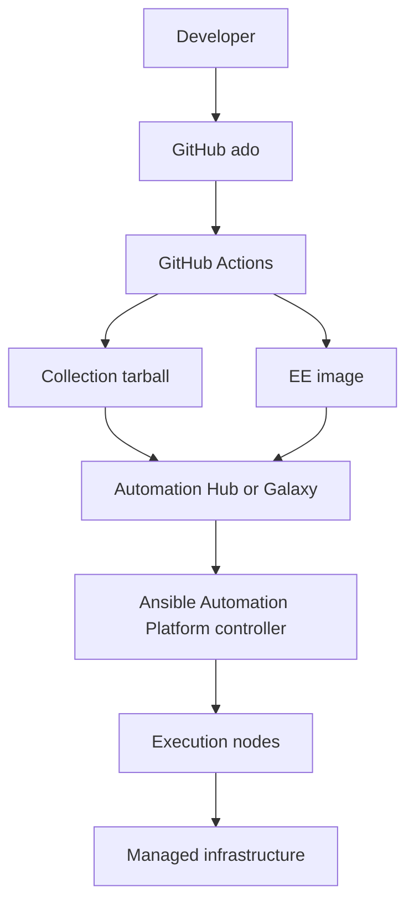
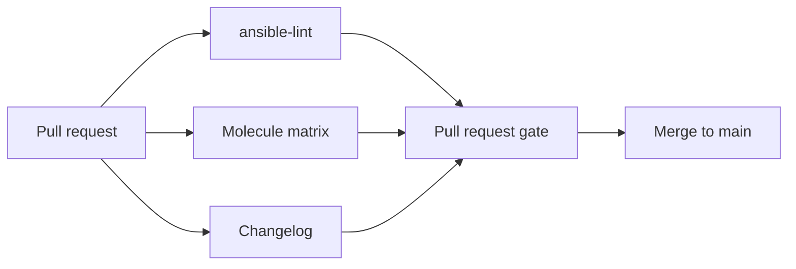

# Architecture Diagrams

Render these Mermaid diagrams on GitHub or in any Mermaid-capable viewer. The same flows appear in the handbook as plain-text diagrams.

## Delivery Pipeline

## Pull Request Gate

## Role Versus Collection Decision

See [Collection Versus Role Decisions](../templates/collection-decision.md).
